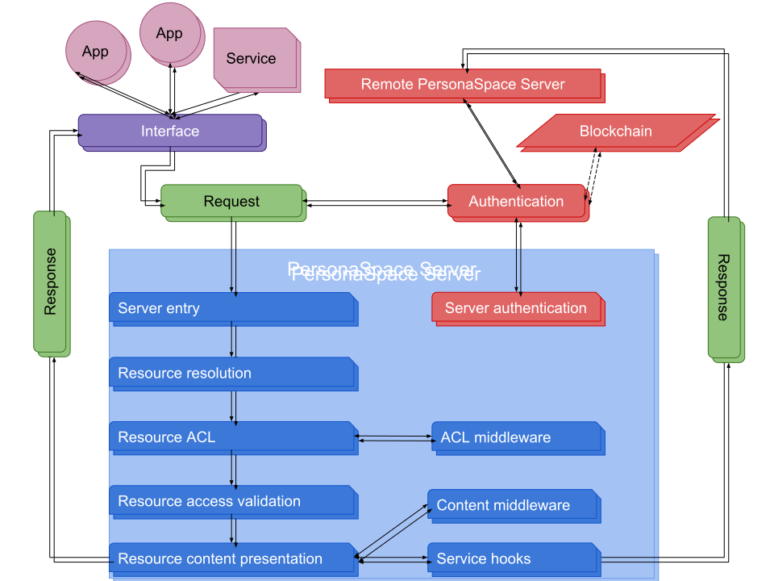

# Architecture

## Apps
Applications are web apps and mobile apps that connect to PersonaSpace servers.

## Services
Services are just that services. Services send requests to or accepts requests from a PersonaSpace server. They send requests to the PersonaSpace user and are given permissions to do very specific things in very specific places on an owner's space. Requests are sent to the service using service hooks configured in the owner's `settings.json` file, when data is created, updated, or deleted.

## Authentication
Authentication is a big part of PersonaSpace even whether a visitor is authenticated or not. Authentication is currently limited to server database authentication, though there are plans to include other authentication methods.

